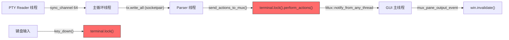

# Pane 假死问题根因分析与修复方案（更新版）

## 背景

Windows 10 上 WezTerm 多 pane 使用时，偶尔某个 pane「假死」——**键盘可以输入，但 UI 不更新**，
必须完全关闭程序重启才能恢复。之前的稳定性修复已将频率降至约 2 小时一次。

> [!IMPORTANT]
> 用户补充的关键信息：症状是「键盘输入后 UI 不刷新」而非「无法输入」。
> 这意味着**问题根因在输出/渲染链路**，而非输入链路。

---

## 数据流架构



**D 和 H 竞争同一把 `terminal` Mutex 锁**。如果 D (parser) 持续大量输出，H (key_down) 可能等待锁，
但 key_down 完成说明锁最终被获取成功——用户说键盘「可以输入」验证了这一点。

那么 UI 不更新只能意味着：**从 parser 到 GUI invalidate 的链路断裂了**。

---

## 根因分析

### Bug A：Parser 线程崩溃后 Recovery 创建不一致状态（🔴 高危）

**文件**: [lib.rs#L400-L453](file:///E:/980BAK/git/wezterm/mux/src/lib.rs#L400-L453)

Windows 上 socketpair 发生错误（如 `WSAECONNRESET`）时，`do_recovery` 会：

```rust
fn do_recovery(...) -> bool {
    // 1. 创建新的 socketpair
    let (new_tx, new_rx) = allocate_socketpair()?;
    *tx = new_tx;
    
    // 2. 创建全新的 dead Arc
    let new_dead = Arc::new(AtomicBool::new(false));  // ← 关键！
    *dead = new_dead;
    
    // 3. 启动新的 parser 线程
    std::thread::spawn(move || {
        parse_buffered_data(pane_clone, &dead_clone, new_rx);
        recovery_clone.store(true, Ordering::Release);
    });
}
```

**问题**：`do_recovery` 创建了全新的 `dead` Arc，但 `send_actions_to_mux` (行 122-148) 中：

```rust
fn send_actions_to_mux(pane: &Weak<dyn Pane>, dead: &Arc<AtomicBool>, actions: Vec<Action>) {
    match pane.upgrade() {
        Some(pane) => {
            pane.perform_actions(actions);
            // ← 如果 perform_actions 成功，发送通知
            Mux::notify_from_any_thread(MuxNotification::PaneOutput(pane.pane_id()));
        }
        None => {
            // ← 如果 pane 已被移除，设置 dead = true
            dead.store(true, Ordering::Release);
        }
    }
}
```

Parser 线程持有的 `dead` 是 recovery **之前**的旧 Arc，recovery 替换了主循环中的 `dead`，
但旧 parser 线程设置的 `dead = true` 只影响旧 Arc。新 parser 线程正常工作，
但如果新 parser 线程也遇到 socketpair 错误，recovery 再次创建新 Arc…
**这种级联 recovery 可能导致状态混乱**。

但更关键的是：**recovery 之间可能存在时间窗口，在此窗口内没有 parser 线程在消费 socketpair 数据**。

### Bug B：`perform_actions` 阻塞导致 PaneOutput 通知延迟（🟡 中危）

**文件**: [lib.rs#L122-L148](file:///E:/980BAK/git/wezterm/mux/src/lib.rs#L122-L148)

`send_actions_to_mux` 先**同步**调用 `pane.perform_actions(actions)`（可能持锁数十毫秒），
然后才发送 `PaneOutput` 通知。如果 `perform_actions` 因与 `key_down` 的 Mutex 竞争
而大幅延迟，`PaneOutput` 通知也会延迟，导致 GUI 长时间不调用 `win.invalidate()`。

在 AI 持续大量输出 + 用户同时打字的场景下，这种竞争会持续累积。

### Bug C：Subscriber 永久取消订阅（🔴 高危）

**文件**: [mod.rs#L1774-L1782](file:///E:/980BAK/git/wezterm/wezterm-gui/src/termwindow/mod.rs#L1774-L1782)

```rust
fn mux_pane_output_event_callback(...) -> bool {
    let mux = Mux::get();
    if mux.get_window(mux_window_id).is_none() {
        log::debug!("PaneOutput: wanted mux_window_id={} from mux, but was not found");
        return false;  // ← 永久取消订阅！
    }
    // ...
}
```

`mux.notify()` 使用 `subscribers.retain(|_, notify| notify(n.clone()))` (行 951-953)。
当回调返回 `false` 时，该 subscriber 被**永久移除**。

> [!CAUTION]
> 如果在某个特定时序下 `mux.get_window(mux_window_id)` 短暂返回 `None`
> （例如 window 正在被重建、workspace 切换、或 RwLock 竞争导致的短暂不一致），
> subscriber 将被永久取消。之后该窗口将**永远收不到 PaneOutput 通知**，
> UI 不再刷新——这正好解释了「键盘可以输入但界面假死」的症状！
>
> 而且只有完全关闭程序才能修复，因为 subscriber 一旦被移除就无法恢复。

### Bug D：bypass_compose 路径 WouldBlock 丢键（🟢 低危，因新症状描述降级）

先前分析的 `keyevent.rs` 中 WouldBlock 按键丢失问题仍然存在，但鉴于用户说「键盘可以输入」，
此 Bug 可能不是导致本次假死的主因（但仍应修复）。

---

## 修复方案

### Fix A：防止 Subscriber 意外永久取消（优先级最高）

#### [MODIFY] [mod.rs](file:///E:/980BAK/git/wezterm/wezterm-gui/src/termwindow/mod.rs)

将 `mux_pane_output_event_callback` 中 `mux.get_window()` 失败时的行为从永久取消改为跳过本次通知：

```diff
 // 行 1774-1782
 let mux = Mux::get();
 if mux.get_window(mux_window_id).is_none() {
     log::debug!(
         "PaneOutput: wanted mux_window_id={} from mux, but \
          was not found, cancel mux subscription",
         mux_window_id
     );
-    return false;
+    // 不永久取消订阅，仅跳过本次通知
+    // 之前返回 false 会导致 subscriber 被永久移除，
+    // 如果是暂时性的（如 workspace 切换），窗口将永远不再更新
+    return true;
 }
```

> [!WARNING]
> 这个修改需要评估：在 window 真正被移除的场景下（如用户关闭了窗口），
> 保持订阅可能导致少量不必要的通知处理。
> 更安全的方案是添加重试计数器：连续 N 次找不到 window 才取消订阅。

#### 更安全的方案（带重试）：

```rust
// 在 subscriber 闭包外部定义
let miss_count = Arc::new(AtomicUsize::new(0));

// 在回调中
if mux.get_window(mux_window_id).is_none() {
    let count = miss_count.fetch_add(1, Ordering::Relaxed);
    if count >= 10 {
        log::warn!("PaneOutput: window {} not found {} times, unsubscribing", 
                   mux_window_id, count);
        return false;
    }
    log::debug!("PaneOutput: window {} temporarily not found (miss #{})", 
                mux_window_id, count);
    return true;
} else {
    miss_count.store(0, Ordering::Relaxed); // 重置计数器
}
```

### Fix B：增强 perform_actions 让步机制

#### [MODIFY] [localpane.rs](file:///E:/980BAK/git/wezterm/mux/src/localpane.rs)

将 `input_pending` 时的让步时间从 100-200μs 增至 500μs，减少 terminal Mutex 竞争对 parser 线程的阻塞。

### Fix C：bypass_compose 路径增加 WouldBlock 处理

#### [MODIFY] [keyevent.rs](file:///E:/980BAK/git/wezterm/wezterm-gui/src/termwindow/keyevent.rs)

（与之前方案相同，修复 WouldBlock 按键丢失）

---

## User Review Required

> [!IMPORTANT]
> **最关键的修复是 Fix A**（Subscriber 永久取消订阅）。这能完美解释所有症状：
> - 「键盘可以输入」→ 输入链路正常
> - 「UI 不更新」→ subscriber 被移除，PaneOutput 通知不再到达 GUI
> - 「必须完全关闭重启」→ subscriber 无法在运行时恢复
>
> 建议优先实施 Fix A，观察效果后再决定 Fix B 和 Fix C。

**请确认**：
1. 是否同意优先实施 Fix A（带重试计数器版本）？
2. Fix B 和 Fix C 是否也一起实施？

---

## 验证方案

### 编译验证

```powershell
cargo check -p wezterm-gui -p mux
```

### 手动测试

1. 启动 WezTerm，分割为两个 pane
2. 两个 pane 同时运行 AI 工具（Claude/Codex），交替操作
3. 观察是否还会出现 UI 假死
4. 如果出现，检查日志中是否有 `PaneOutput: window ... not found` 消息
